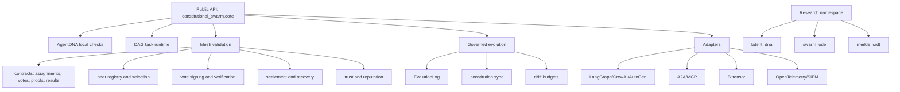

# constitutional_swarm Modularization and Max-Potential Roadmap

**Date:** 2026-04-30

## North-star product potential

`constitutional_swarm` can become the governance runtime for agent societies: a package that lets enterprises, labs, and decentralized networks prove that multi-agent work was assigned, validated, voted on, settled, and evolved under an explicit constitution.

The maximum product is not another agent framework. It is the **trust, audit, and evolution layer** that plugs into every agent framework.

## Target architecture

## Modularization sequence

### Phase 1, low-risk seams

Goal: reduce `mesh.py` without API breaks.

1. Extract immutable contracts to `mesh_types.py`.
2. Extract crypto/proof helpers to `mesh_crypto.py`.
3. Extract settlement serializers/recovery to `mesh_settlement.py`.
4. Extract peer registry and selection to `mesh_peers.py`.
5. Extract vote request/response flow to `mesh_voting.py`.

Compatibility rule: `from constitutional_swarm.mesh import ConstitutionalMesh, MeshProof, ...` must keep working until at least `0.4.0`.

### Phase 2, production boundary

1. Add `constitutional_swarm.core` as the stable runtime API.
2. Move research modules under `constitutional_swarm.research` or keep import shims.
3. Move Bittensor-only code behind explicit optional extra boundaries.
4. Add import-boundary tests that fail if stable core imports torch, transformers, bittensor, or network transports.

### Phase 3, integration moat

1. Agent framework adapters: LangGraph, CrewAI, AutoGen, MCP/A2A.
2. Observability: OpenTelemetry spans for validation, vote collection, settlement, and drift events.
3. SIEM/audit exports: JSONL, SQLite, S3-compatible object storage, and signed transparency logs.
4. Admin control plane: kill switch, constitution rotation, peer health, pending settlement recovery.

### Phase 4, product moat

1. Governed self-evolution with explicit drift budgets and rollback.
2. Regulated-domain policy packs: legal, healthcare, finance, public sector.
3. Verifiable benchmark suite for multi-agent governance failures.
4. Hosted compliance evidence API and downloadable audit bundles.

## First slice completed in this branch

This pass starts Phase 1 by extracting:

- `constitutional_swarm.mesh_types`: immutable mesh contracts,
- `constitutional_swarm.mesh_crypto`: vote payload, key coercion, signature verification, and Merkle proof hashing helpers.

`constitutional_swarm.mesh` remains the compatibility facade and still re-exports the same public names.

## Success metrics

- `mesh.py` reduced from ~1800 lines to below 600 lines across focused modules.
- Stable core imports no research/heavy optional dependencies.
- 100% backward compatibility for documented imports through `0.3.x`.
- Full test suite stays green after each extraction.
- Public docs show stable production path separately from research path.
